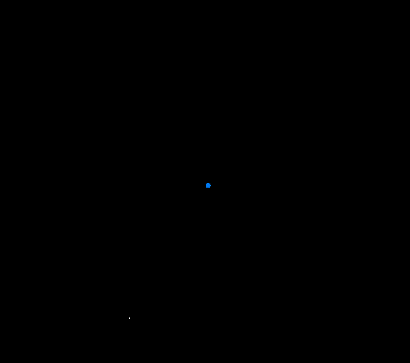

# nbody00
<a href="https://raja.rocks/projects/E100P0507A00.html"></a>

*n*-body simulation, attempt #01.

Simulates the moon and earth in a two-body system. Decently accurate and
decently to scale, although there are certain imperfections.



Using the force of gravity on the moon and principles of circular motion, it
calculates a perfect circular orbit for the moon. This can be seen printed in
`stdout`, with the %error to the expected period being less than a percent off.

## Building

Requires raylib to be installed on system.
```
pacman -S raylib
```

To build:
```
make
```

